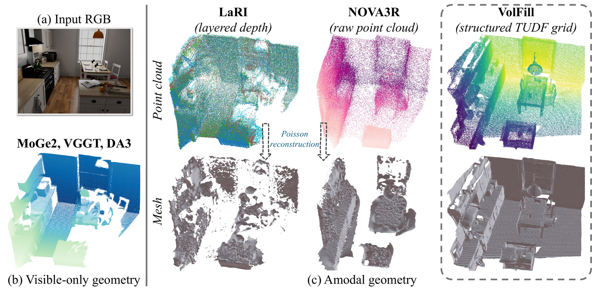

# VolFill: Single-View Amodal 3D Scene Reconstruction with Volumetric Flow Matching

<p align="center">
  Tuan Duc Ngo<sup>1</sup> &nbsp;·&nbsp;
  Chuang Gan<sup>1</sup> &nbsp;·&nbsp;
  Evangelos Kalogerakis<sup>1,2</sup>
</p>
<p align="center">
  <sup>1</sup>University of Massachusetts Amherst &nbsp;&nbsp;
  <sup>2</sup>Technical University of Crete
</p>

<p align="center">
  <a href="https://arxiv.org/abs/2605.31466">
    
  </a>
  <a href="https://ngoductuanlhp.github.io/VolFill/">
    
  </a>
  <a href="https://github.com/ngoductuanlhp/VolFill">
    
  </a>
  <a href="https://huggingface.co/TuanNgo/VolFill">
    
  </a>
  <a href="LICENSE">
    
  </a>
</p>

<p align="center">
  
</p>

Recover the **complete** 3D scene geometry — including occluded surfaces — from a
single RGB image, represented as a 256³ Truncated Unsigned Distance Function
(TUDF) grid.

## 🚧 Code Release

Inference code and pretrained checkpoints are available now. Training,
evaluation, and dataset preprocessing code will be released here shortly.
⭐ this repository to be notified.

- [x] Inference + pretrained checkpoints
- [ ] Training pipeline (Stage 1 VAE, Stage 2 DiT)
- [ ] Evaluation scripts (SCRREAM, NRGB-D)
- [ ] Dataset preprocessing

## 🧭 Method Overview

VolFill represents the full scene as a 256³ TUDF and recovers it with a two-stage
latent generative model: a hybrid 3D VAE compresses the volume to a compact
latent, and a latent DiT with flow matching generates it — conditioned on frozen
MoGe-v2 image features and a visible-geometry latent that anchors the occluded
regions.

## 🛠️ Installation

Targets **CUDA 13.0 / RTX 40-series**.

```bash
conda create -n volfill python=3.11 -y
conda activate volfill
pip install -U pip setuptools wheel ninja

# 1. Torch first (so the from-source build below links the right ABI).
pip install --extra-index-url https://download.pytorch.org/whl/cu130 \
    torch==2.10.0+cu130 torchvision==0.25.0+cu130 triton==3.6.0

# 2. The rest. requirements.txt declares the PyTorch (cu130) and rathaROG
#    (spconv-cu130) indexes, and builds utils3d from source.
pip install -r requirements.txt
```

Optional extras (see the bottom of `requirements.txt`): `cupy-cuda13x`
(GPU-accelerated EDT for the visible-TUDF step), `xformers` (faster DINOv2
attention; PyTorch native SDPA is used otherwise), and `open3d`
(point-cloud / mesh export).

## 📦 Checkpoints

The model is distributed on the Hugging Face Hub. The weights, config, and
latent statistics download automatically on first run — nothing to fetch by hand:

```bash
python -m volfill.amodal.inference_latent_visible \
    --hf_repo TuanNgo/VolFill \
    --input_path path/to/image.jpg \
    --output ./results/
```

> The MoGe geometry prior (`Ruicheng/moge-2-vitl`, `Ruicheng/moge-2-vitl-normal`)
> is likewise fetched from the Hub on first run.

The Hub repo holds four files: `volfill_dit.pth`, `volfill_vae.pth`,
`inference.yaml`, and `latent_stats_16x.npy`.

### Manual download (Google Drive)

Prefer to grab the weights by hand? Download them into `checkpoints/` and use the
[local-checkpoint commands](#-from-local-checkpoints):

| File | Google Drive |
|---|---|
| `volfill_dit.pth` | [download](https://drive.google.com/file/d/1NztOTqMIoyj6NdrpOttvSw_rfk_inX9i/view?usp=sharing) |
| `volfill_vae.pth` | [download](https://drive.google.com/file/d/1Du3F0UL8mfbGyi8WWlhy6zjekoJ18yKq/view?usp=sharing) |

Or from the command line with [`gdown`](https://github.com/wkentaro/gdown):

```bash
pip install gdown
mkdir -p checkpoints
gdown 1NztOTqMIoyj6NdrpOttvSw_rfk_inX9i -O checkpoints/volfill_dit.pth
gdown 1Du3F0UL8mfbGyi8WWlhy6zjekoJ18yKq -O checkpoints/volfill_vae.pth
```

## 🚀 Inference

### 🤗 From the Hugging Face Hub (recommended)

CLI:

```bash
# Single image (MoGe geometry computed online — no camera metadata needed)
python -m volfill.amodal.inference_latent_visible \
    --hf_repo TuanNgo/VolFill --input_path image.jpg --output ./results/

# Batch over a directory of samples listed in a JSON split
python -m volfill.amodal.inference_latent_visible \
    --hf_repo TuanNgo/VolFill \
    --input_path path/to/data_root/ --split path/to/split.json --output ./results/
```

Python:

```python
from PIL import Image
from volfill.amodal.inference_latent_visible import LatentTUDFVisibleInference

infer  = LatentTUDFVisibleInference.from_pretrained("TuanNgo/VolFill")
result = infer(Image.open("image.jpg").convert("RGB"))
# result["tudf"]: (1, 1, 256, 256, 256) predicted TUDF in [-1, 1]
```

### 💾 From local checkpoints

If you have the weights locally (e.g. under `checkpoints/`):

```bash
python -m volfill.amodal.inference_latent_visible \
    --config configs/inference.yaml \
    --dit_checkpoint checkpoints/volfill_dit.pth \
    --vae_checkpoint checkpoints/volfill_vae.pth \
    --input_path path/to/image.jpg \
    --output ./results/
```

Useful flags: `--cfg_strength` (default 3.0), `--steps` (default 50),
`--device`, `--tudf_threshold`. Per sample, the pipeline writes a
`pred_tudf_256.npz` (the predicted TUDF), a `metadata.json` (canonical bbox +
field range), and a copy of the input image.

## 👀 Visualization

Turn a predicted TUDF into a point cloud and inspect it in an interactive
[viser](https://viser.studio) viewer:

```bash
pip install viser matplotlib
python -m volfill.visualize --sample_dir results/<sample> --threshold 0.8
```

Then open the printed `http://localhost:7891` URL. Use `--save_ply` to also
export `pred_points.ply` (no extra deps), `--no_viewer` for headless export, or
`--method marching_cubes` for an isosurface (needs `scikit-image`).

## 🗂️ Repo Layout

```
volfill/
  amodal/
    inference_latent_visible.py   # end-to-end inference entry point
    config_utils.py               # YAML config loader
    flow_matching.py              # Euler ODE sampler
    checkpoint_utils.py           # checkpoint loading
    model/
      vae/                        # sparse encoder + hybrid sparse decoder
      dit/                        # CoarseTUDFDiT, LatentTUDFDiTVisible
      conditioner/                # MoGeConditioner (frozen image prior)
    datasets/                     # image-sizing helper
    preprocess/                   # MoGe points -> visible TUDF helpers
  visualize.py                    # TUDF -> point cloud viewer (viser) / .ply export
  utils/                          # small runtime utilities
configs/inference.yaml            # model + sampler settings for the released ckpt
assets/latent_stats_16x.npy       # latent normalization statistics
third_party/
  moge/                           # MoGe-v2 geometry prior (frozen)
  trellis/modules/sparse/         # TRELLIS sparse-conv modules (VAE backend)
```

## 📝 Notes

- **Sparse-conv loader.** TRELLIS sparse modules are loaded via a custom importer
  in `volfill/amodal/model/vae/latent_vae_sparse_encoder.py` that bypasses
  TRELLIS's top-level `__init__.py`. Do not `import trellis` at the top level.
- **MoGe stays frozen.** `MoGeConditioner.train()` keeps the MoGe encoder in
  `.eval()` always; it is never updated.

## 🙏 Acknowledgements

This codebase builds on [LaRI (Ruili Feng et al.)](https://github.com/ruili3/LaRI)
and reuses sparse-conv modules from
[TRELLIS (Microsoft)](https://github.com/microsoft/TRELLIS). The visible geometry
prior is provided by [MoGe-v2 (Microsoft)](https://github.com/microsoft/MoGe).
Thanks to the authors of all these projects. Bundled third-party code under
`third_party/` remains under its original license.

## 📝 Citation

If you find VolFill useful, please cite:

```bibtex
@article{ngo2026volfill,
  title   = {VolFill: Single-View Amodal 3D Scene Reconstruction with Volumetric Flow Matching},
  author  = {Ngo, Tuan Duc and Gan, Chuang and Kalogerakis, Evangelos},
  journal = {arXiv preprint arXiv:2605.31466},
  year    = {2026}
}
```

## ⚖️ License

Released under the [MIT License](LICENSE).
